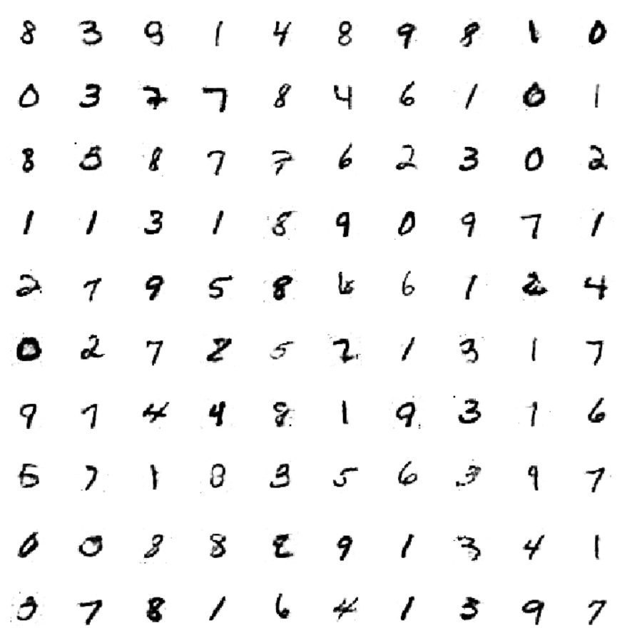

# MNIST_gan
A simple GAN network trained to generate MNIST digits.
Both the Generator and the Discriminator are Multi-Layer Perceptrons (MLPs), basically a Vanilla GAN which was introduced by Ian Goodfellow in his landmark paper.
One sided label-smoothing is done to ensure stable training.

